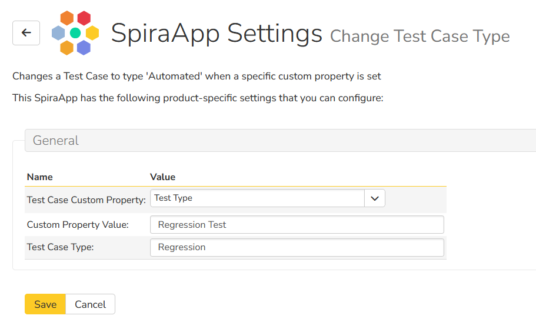

# Sample SpiraApp: Change Test Case Type

This sample demonstrates how you can write a SpiraApp to change
the type of a test case based on the value selected in a specific
test case field.

It was developed for a customer that was looking for a way to change
the type of a test case from manual to automated so that it would
be able to use a different workflow once the test case was
marked as being ready for automation.

This is provided 'as-is' by Inflectra and does not come with any
warranty or support.

## How to use the Sample SpiraApp

1. First you need to go to Administration > General Settings in Spira
2. Enable **Developer Mode** so that you can side-load non-official SpiraApps
3. Go to Administration > SpiraApps and upload the contents of the `app` folder of this repository:

    `112dc0a1-2a55-4e03-8907-7acb79f22d59.spiraapp`

4. Once uploaded, the new SpiraApp will appear in the list
5. Activate the SpiraApp for use in your system
6. Go to a Spira product that you wish to use the SpiraApp with
7. Click the option to **Enable** the SpiraApp for this product
8. Now go to the product settings for this SpiraApp

### Configuring the Settings

On the product settings page, you need to:

1. Choose from the dropdown list, the `List` custom property that will be used to trigger the change in test case type
2. Enter the text value of the list custom property that must be set to trigger the change
3. Enter the text value of the **Test Case Type** that you want the test case type to change to when triggered.

For example:

You can now use this SpiraApp on your product.